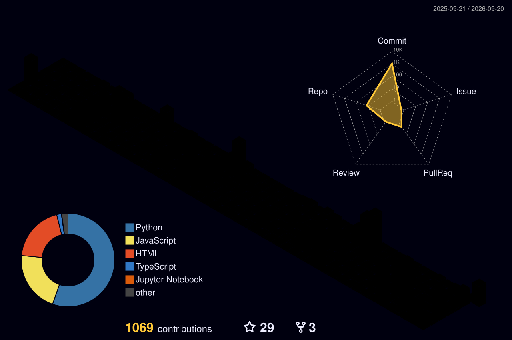

<!--
Profile README adapted from the classic banner/about/stack/stats/contact layout
popularized in Awesome Profile README template collections. Template references:
- https://github.com/kautukkundan/Awesome-Profile-README-templates
- https://github.com/z0zerox/Awesome-Profile-README-Templates (MIT)
-->

  

  
  
  

  

## About

I am a PhD student at HKUST(GZ), working on embodied intelligence, vision-language-action models, robotic manipulation, and AIoT systems. My current research focuses on reliable decision-making and replanning for embodied agents, with applications in robot manipulation and autonomous maritime robotics.

- Affiliation: HKUST(GZ), NEBULISLab
- Location: Guangdong, China
- Research: Embodied AI, VLA models, robotic manipulation, autonomous agents
- Engineering: Python, PyTorch, ROS, database systems, and backend development

## Research Interests

  
  
  
  
  

## Selected Publication

| Work | Venue | Focus |
| --- | --- | --- |
| **When Replanning Becomes the Bottleneck: Budgeted Replanning for Embodied Agents** | ICML 2026 | Budgeted replanning for embodied agents |

## Selected Projects

| Project | Description |
| --- | --- |
| **BRACE** | Budgeted replanning for embodied agents under limited inference budgets |
| **E-RECAP** | Cost-aware pruning for efficient embodied replanning |
| **USV-Mounted Robotic Manipulation** | Autonomous maritime field intervention with robotic arms |

## Technical Stack

  
  
  
  
  
  
  
  

## Profile Highlights

  

  

## Animated Contributions

  <picture>
    <source media="(prefers-color-scheme: dark)" srcset="https://raw.githubusercontent.com/Shuaijun-LIU/Shuaijun-LIU/output/github-contribution-grid-snake-dark.svg" />
    <source media="(prefers-color-scheme: light)" srcset="https://raw.githubusercontent.com/Shuaijun-LIU/Shuaijun-LIU/output/github-contribution-grid-snake.svg" />
    
  </picture>

## 3D Contribution Map

  

## Research Mode

  

<table>
  <tr>
    <td width="50%">
      <h3 align="center">Research</h3>
      
Embodied agents, VLA models, budgeted replanning, robotic manipulation, maritime autonomy.

    </td>
    <td width="50%">
      <h3 align="center">Engineering</h3>
      
Learning systems, robotics software, backend services, data systems, reproducible experiments.

    </td>
  </tr>
</table>

<!--
Archived GitHub stats widgets. Kept for later filtering/reuse.

  
  

-->

## Links

  <a href="https://shuaijun-liu.github.io/">Website</a> |
  <a href="https://orcid.org/0000-0002-8443-3713">ORCID</a> |
  <a href="mailto:shuaijun.liu@outlook.com">Email</a> |
  <a href="https://github.com/NEBULISLab">NEBULISLab</a>

  

